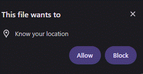
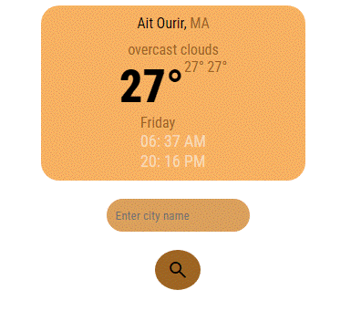
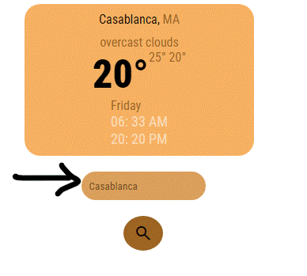

# Weather-app
WeatherNow: A student-built weather web app using HTML, CSS, and JavaScript. Fetches real-time weather data via a free API, featuring weather ,location search and responsive design.


## Demo

When you first get to the app you get a notification for accessing your location so the app can fetch the weather data for your city






You can write in the text input any city that comes to your mind and you'll get the current weather data for that city



# Commands
```
git clone https://github.com/ThexOnex/Weather-app.git
cd Weather-app
cd app
```
then open the index.html file